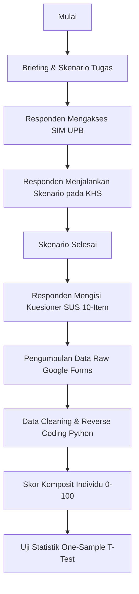
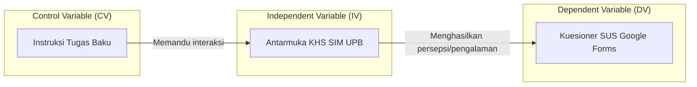

# Arsitektur Eksperimen dan Skema Pengukuran

Penelitian ini tidak mengembangkan perangkat lunak baru (seperti *backend* atau basis data), melainkan merancang sebuah sistem pengukuran (instrumen eksperimen) untuk mengkuantifikasi usabilitas dari sistem *existing*.

## 1. Diagram Alur Eksperimen

Berikut adalah alur bagaimana mahasiswa (responden) berinteraksi dengan instrumen pengukuran hingga menghasilkan data yang siap diolah.

## 2. Pemetaan Variabel ke Komponen Eksperimen

Sistem dirancang secara modular agar objek yang dievaluasi terisolasi dari alat ukurnya.

## 3. Skema Perhitungan System Usability Scale (SUS)

Instrumen pengukuran bergantung pada 10 butir pertanyaan SUS baku dengan 5 opsi skala Likert (1 = Sangat Tidak Setuju, hingga 5 = Sangat Setuju).

**Formula Reverse Coding:**
*   **Item Positif (Ganjil 1, 3, 5, 7, 9):** Nilai Skala - 1
*   **Item Negatif (Genap 2, 4, 6, 8, 10):** 5 - Nilai Skala

**Kalkulasi Skor Komposit:**
`Skor Akhir SUS = (Total Nilai Ganjil + Total Nilai Genap) * 2.5`

Rentang nilai yang dihasilkan adalah 0 hingga 100. Nilai ini berskala rasio/interval dan akan dibandingkan dengan **Baseline 68** (*Acceptable Score*).

## 4. Struktur Data dan Skrip Python (sus_calculator.py)

Data yang diambil dari Google Forms (format CSV) akan diolah menggunakan skrip Python (`sus_calculator.py`) ke dalam skema kolom sebagai berikut:

| Kolom | Tipe Data | Deskripsi |
|---|---|---|
| `Timestamp` | DateTime | Waktu pengisian untuk melacak keaslian. |
| `Nama/ID` | String | Identitas responden (dapat dianonimkan). |
| `Program Studi` | Kategori | Untuk keperluan validasi representasi demografi. |
| `Q1` s.d. `Q10` | Integer (1-5) | Jawaban mentah skala Likert dari responden. |
| `Conv_Q1` s.d. `Conv_Q10` | Integer (0-4) | Hasil *reverse coding* sesuai formula SUS. |
| `Total_Score` | Float (0-100) | Kalkulasi akhir `(Sum(Conv_Q1..Q10) * 2.5)`. |
