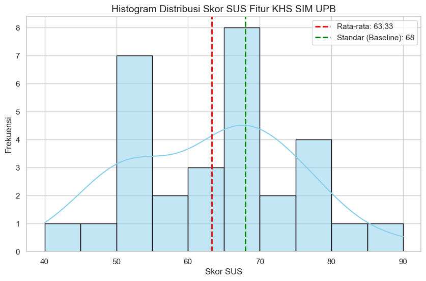
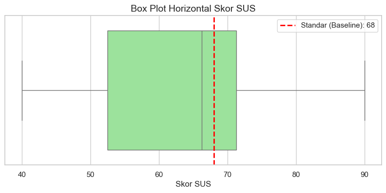

## 4. Hasil
Proses pengumpulan data berlangsung singkat selama masa perkuliahan aktif untuk mencegah risiko intervensi berupa pembaruan (*patch*) antarmuka mendadak dari pihak kampus. Sebanyak 30 respons masuk dan secara keseluruhan valid, tanpa ada indikasi jawaban linear (*straight-lining*).

### 4.1. Statistik Deskriptif Skor SUS
Hasil kalkulasi otomatis melalui skrip Python pada dataset menunjukkan perolehan skor SUS individual yang sangat bervariasi. Skor minimum yang diberikan oleh responden adalah 40.0, sedangkan skor maksimum mencapai 90.0, dengan nilai median sebesar 66.25. 

Secara agregat, dari 30 sampel data responden, didapatkan nilai rata-rata (*mean*) Skor Komposit SUS sebesar **63.33** dengan angka Standar Deviasi (SD) sebesar 11.75. Sebaran frekuensi dan titik lokasi nilai rata-rata tersebut terhadap batas standar kelayakan (68.0) dapat diamati melalui histogram pada Gambar 1.

Selain itu, observasi mendalam terhadap sebaran data menggunakan analisis kuartil membuktikan integritas respons yang baik tanpa adanya titik pencilan ekstrem (*outlier*) di luar batas rentang interkuartil. Hal ini divisualisasikan pada *box plot* di bawah ini (Gambar 2).

### 4.2. Uji Hipotesis *One-Sample T-Test*
Uji komparatif *One-Sample T-Test* dilakukan untuk menguji Hipotesis Alternatif (H1) yang menyatakan bahwa rata-rata skor SUS populasi fitur KHS SIM UPB secara signifikan lebih besar daripada nilai ambang batas kelayakan global 68. 

Hasil uji *T-Test* menghasilkan nilai statistik T sebesar -2.175. Mengingat rata-rata sampel (63.33) lebih kecil daripada *test value* (68), maka perhitungan probabilitas searah (1-tailed p-value untuk H1 > 68) menghasilkan angka signifikansi sebesar 0.9810 (p > 0.05). Oleh karena itu, H1 ditolak. Secara statistik, rata-rata skor SUS antarmuka fitur KHS SIM UPB terbukti berada di bawah standar kelayakan.

## 5. Pembahasan
Penolakan hipotesis H1 (p > 0.05) pada uji statistik secara meyakinkan mengkonfirmasi asumsi awal bahwa antarmuka KHS SIM UPB saat ini masih menyimpan masalah *usability* struktural. Rata-rata skor final sebesar 63.33 membawa sistem KHS UPB ke dalam kategori peringkat huruf 'D', tergolong *Marginal Passive* atau berkualifikasi *Poor* (kurang layak). Angka ini menunjukkan bahwa sistem tidak sampai pada tahap "mustahil digunakan", namun interaksi yang berlangsung tidak mulus dan memicu frustrasi, membuat pengguna enggan menggunakan sistem tersebut jika bukan karena kewajiban akademis mutlak.

Untuk memahami mengapa skor tersebut jatuh di bawah 68, analisis pada kolom umpan balik (*feedback*) kualitatif responden memberikan jawaban yang sangat jernih. Mayoritas catatan kaki responden tidak mempermasalahkan sistem di ranah peramban desktop (PC), melainkan mengeluhkan ketidakmampuan responsivitas (*responsiveness*) komponen antarmuka saat diakses dari gawai genggam (*mobile/smartphone*). Keluhan paling umum menyoroti bahwa "akses harus di-zoom dulu", "tampilan tabel KHS yang terpotong di layar kecil", hingga desakan perlunya "optimasi tampilan pada layar HP". 

Keluhan ini selaras dengan struktur 10 pertanyaan SUS. Mahasiswa dipaksa mempelajari langkah adaptif tersendiri, yakni mencubit dan menggeser (*pinch-and-pan*) layar terus-menerus, untuk bisa merangkai informasi nilai mata kuliah menjadi satu kesatuan di layar *mobile*. Hal inilah yang menjadi penyumbang terbesar rendahnya *usability score* pada pertanyaan terkait "kemudahan penggunaan" dan "kerumitan desain". 

Kendati demikian, analisis dalam penelitian ini memiliki limitasi inheren berupa terbatasnya jumlah sampel (N=30) yang mayoritas didominasi oleh mahasiswa program studi Ilmu Komputer (yang kemungkinan memiliki standar literasi digital tinggi). Walaupun secara statistik angka sampel ini memadai untuk analisis parametrik dasar, riset lanjutan dengan rentang demografi fakultas yang lebih besar tetap direkomendasikan guna memperoleh peta keluhan yang lebih komprehensif.
